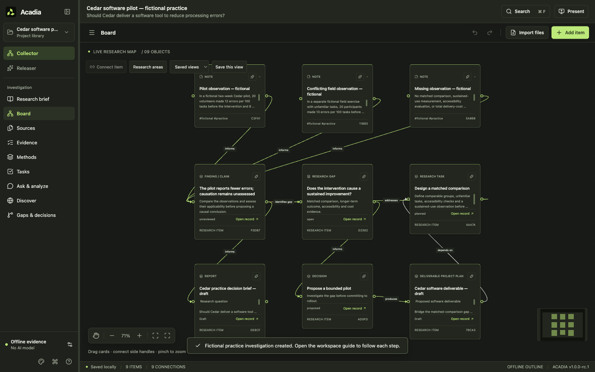
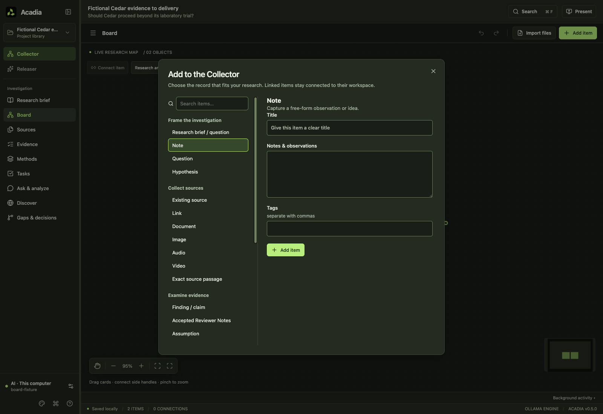
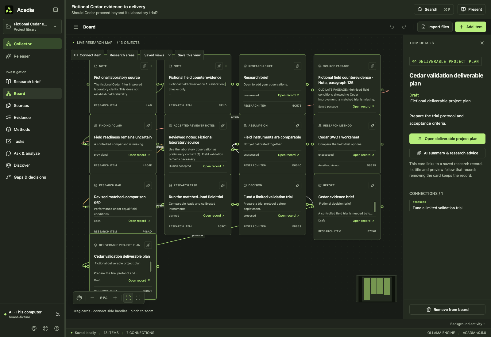
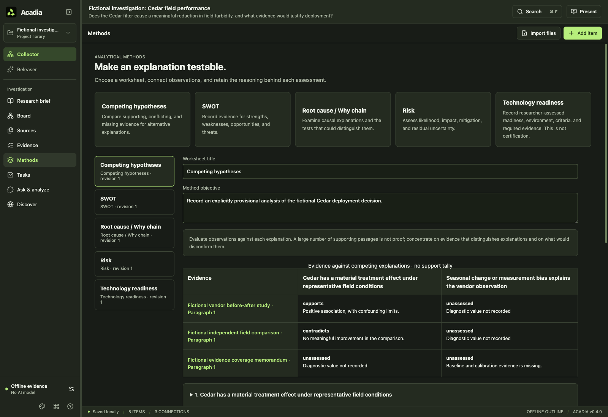

<p align="center">
  
</p>

<h1 align="center">Acadia</h1>
<p align="center"><strong>Collect evidence. Connect ideas. Release understanding.</strong></p>
<p align="center">
  <a href="https://github.com/byrneDev/Acadia/releases">Download</a> ·
  <a href="docs/QUICK-START.md">Quick start</a> ·
  <a href="docs/LOCAL-AI.md">Local AI</a> ·
  <a href="CONTRIBUTING.md">Contribute</a> ·
  <a href="SUPPORT.md">Get help</a>
</p>

[](https://github.com/byrneDev/Acadia/actions/workflows/ci.yml)
[](https://github.com/byrneDev/Acadia/actions/workflows/release.yml)
[](LICENSE)

Acadia is a desktop research workspace for turning a collection of documents, links, and ideas into an argument you can inspect. Arrange evidence on a large canvas, record what supports or contradicts a claim, identify the missing information, and develop a report whose citations lead back to saved source passages.

**The Collector** is your working space. **The Releaser** is where findings become editable reports and explicitly released presentations. A separate display can show a finished revision while you continue investigating privately.

This branch is **Acadia 1.0.0-rc.1**, a release candidate for one researcher. **V0.5.0 remains the published release**; RC source changes and local tests do not establish a production v1 release. It runs locally without an account. AI is optional: the offline engine organizes evidence, while a separately configured local or cloud model can draft analysis.

## Download and start

Get the package for your computer from [GitHub Releases](https://github.com/byrneDev/Acadia/releases). Each release records its checksums and validation results; a packaged target is not automatically a natively tested platform.

| Platform             | Distribution                               | Getting started                                        |
| -------------------- | ------------------------------------------ | ------------------------------------------------------ |
| Ubuntu 24.04, x64    | `.deb` package or `.AppImage`              | Follow the [Linux guide](docs/LINUX.md).               |
| macOS, Apple Silicon | ZIP containing `Acadia.app`                | Extract the app and move it to Applications.           |
| Windows, x64         | NSIS installer; ZIP handoff where provided | Extract the ZIP if applicable, then run the installer. |

The published v0.5.0 packages are unsigned and the macOS app is not notarized. Candidate packages must state their own signing status. Stable v1 publication is blocked pending verified distribution signing/notarization and external acceptance; no production signing or tenant/hardware acceptance is claimed here. Intel Mac, Linux ARM, and other Linux distributions are not release targets. See [Support](SUPPORT.md) for platform and troubleshooting expectations.

In the RC, open **Workspace guide** to create a separate fictional software or curriculum practice investigation. The original project stays in your library; practice records are explicitly unreviewed. You can also start with the included [fictional library-hours investigation](docs/samples/Library-hours-sample.acadia), or create a project and enter the question you want to investigate. No API key is needed to collect, search, organize, edit, or export research.

## Two spaces, one investigation

### Collector — follow the evidence

- **Research brief:** define and revise the question, decision, scope, inclusion criteria and success criteria.
- **Methods:** use five editable worksheets for competing hypotheses, SWOT, root causes, risk and technology readiness. Link evidence, assumptions and gap tasks; request AI review explicitly.
- **Board:** use the grouped, searchable **Add item** picker to map questions, sources, reviewed evidence, findings, gaps, tasks and deliverables. Linked cards open their source reader or authoritative editor; saved edits update their previews. Place all five method worksheets, draw labeled relationships, organize named areas and save useful views.
- **Item AI advice:** explicitly summarize a collected item or saved source version and get suggested research uses, limitations, and next steps. Edit and accept the proposal into **Reviewer Notes** to save it as linked evidence, retaining historical citations and your acceptance record. Original item notes remain intact.
- **Sources:** read searchable PDF, Word, text, and captured web passages with page or paragraph locations, acquisition dates, and source versions. Use local English OCR for scanned PDFs and images; compare a PDF passage against its original historical page.
- **Evidence:** compare supporting passages, contradictions, alternative explanations, and researcher assessments without treating a drawn connection as proof.
- **Tasks:** connect follow-up work to a question or gap, with completion criteria, status, optional dates, and resulting sources.
- **Gaps & decisions:** record missing information, resolution criteria, related work, proposed actions, alternatives, assumptions and deliverables. Changes receive revisions; resolving a gap or making a decision remains a researcher action.
- **Ask & analyze:** question the included collection, follow passage citations, and inspect recorded analysis runs. AI connection suggestions require acceptance.
- **Discover:** review and approve a bounded external search plan, then decide which results enter the source library.

### Releaser — make the reasoning reviewable

Draft a decision brief, hypothesis, research plan, whitepaper, gap analysis, or needs analysis. Edit headings, lists, tables, and numbered citations. **Cite source passage** inserts a saved passage reference into manual writing without calling AI. Request a proposed revision to selected text and review it before applying it.

Save report revisions and choose exactly which one to release. Working drafts stay private to the main window; the second display receives the selected released snapshot. Export an editable **DOCX**, a print-oriented **PDF**, or **Markdown**, including bibliography and source locations.

### Evidence that survives revision

Source versions and report snapshots preserve the evidence behind older findings. Updating a document does not silently redirect its previous citations. The app flags changed sources for reconsideration, distinguishes partial or failed extraction from complete coverage, and avoids counting identical files as independent corroboration.

SQLite full-text search covers the indexed collection. A model still receives a finite selection of passages, with coverage limits recorded in the result. A verified citation establishes saved source provenance; it does not establish that a conclusion is correct. Automatic quotation detection is not exhaustive, so quoted prose still needs human review.

## Desktop workspace

The OS-aware shell introduced in v0.4 is retained in the RC: system/light/dark themes, a compact navigation sidebar, contextual source reading, and a report-focused editor. Board and report positions survive view switches. Platform menus, keyboard commands, named connection presets, and deliberate model checks reduce setup friction. See the [desktop GUI notes](docs/GUI-REFRESH.md) for behavior and [v1 validation](docs/VALIDATION-v1.0.md) for current candidate checks and outstanding gates.

## Research methods, delivery plans and data exports

Versioned source appraisals, shared-origin review, structured findings and assumptions were introduced in v0.4 and remain available. Inspect the reasoning behind a conclusion and the observation that could change it. Preview an editable pedigree appendix and acknowledge analytical limitations before release. See [Research methods](docs/RESEARCH-METHODS.md).

After analysis, **Plan a deliverable** proposes a reviewable software, curriculum or other project plan. Link saved gap/finding revisions, requirements or learning objectives, acceptance tests, and exact verification passages. Completing work does not resolve the gap automatically. Private work-package drafts survive restart; review the [PMIS mapping preview and repeated-import limits](docs/PMIS-HANDOFF.md) before exporting for Monday, Jira or Microsoft Planner. Use **Export data for Power BI** for linked research and delivery tables with a [data dictionary and relationship guide](docs/POWER-BI.md). Exports are local files; they do not publish data or connect to your tenant automatically.

New in **v0.5.0**, the grouped **Add item** picker follows **Question → Sources → Reviewed Evidence → Findings → Gaps → Tasks → Deliverables**. Search for a type, create a record in its workspace, or place an existing record on the free canvas. Per-item AI advice can be edited and explicitly accepted into Reviewer Notes and Evidence. Linked cards open their authoritative editor; removing a placement keeps the research record. See [Research-to-delivery boards](docs/RESEARCH-TO-DELIVERY.md).

The RC exports **portable format v5**, requiring Acadia v1.0 or its v1 prereleases. Formats v1–v4 remain importable with missing assessments left unassessed. V0.5 cannot open v5. The new format retains private drafts, delivery references, and historical evidence. Use **Backup, recovery and updates** to make a checked whole-library backup before upgrading. See [Recovery](docs/RECOVERY.md) and [v1 validation](docs/VALIDATION-v1.0.md).

The candidate also adds paginated collection/source/history search, keyboard movement of selected board items, saved private research drafts with conflict handling, explicit synthetic model-generation tests, credential status/removal, redacted support diagnostics, and a manual update check. These maintenance actions do not upload research or install updates.

## A look inside



_V1 candidate: practice with conflicting sources, an unreviewed finding, an open gap, research tasks, a proposed decision and a deliverable. The guide also includes a curriculum investigation; neither requires AI._



_V0.5: choose a research item by purpose, create a record or link an existing one._



_V0.5: follow the chain from a question and reviewed evidence to a decision and useful work. Linked cards retain their underlying research records._



_Methods: examine competing explanations using the included fictional investigation. Source locations, support review and confidence remain distinct._


_Collector: arrange evidence and follow the relationships between ideas._


_Releaser: review a cited draft, save revisions, and choose what appears on the output display._

## Local data and optional connections

| Action                                                  | What leaves the computer                                                                        |
| ------------------------------------------------------- | ----------------------------------------------------------------------------------------------- |
| Offline research, extraction, OCR, editing, and exports | No document content is sent to an analysis service.                                             |
| Local model analysis                                    | The question, instructions, and selected passages go to your configured loopback model service. |
| Cloud model analysis                                    | The same research inputs go to the provider explicitly selected for that project.               |
| Capture a website                                       | Acadia requests the URL you chose and saves a readable snapshot.                                |
| Approved Brave discovery                                | The displayed queries go to Brave Search; a candidate page is captured only when accepted.      |

Local projects never silently fall back to cloud analysis. Models are installed and operated separately from Acadia. Start with [Local AI](docs/LOCAL-AI.md), or configure a compatible chat-completions endpoint in research engine settings.

Keys entered in the interface are submitted to the main process; saved keys are not returned in renderer settings or included in project exports. Analysis keys use operating-system secure storage when a usable backend is available and otherwise remain session-only. Saving a Brave Search key requires usable secure storage; it is refused when that storage is unavailable. Research files and the SQLite database are ordinary local data, **not an encrypted vault**. A portable `.acadia` archive contains research content and originals: share it intentionally and keep backups.

Brave Search is optional and independent of the analysis provider. Plans permit at most five queries and twenty candidates, with additional searches requiring another approval. Acadia does not conduct autonomous background investigations.

## Run from source

Install **Node.js 24.x**, npm, and Git. Electron supplies its own runtime for the packaged app; a database server is not required.

```sh
git clone https://github.com/byrneDev/Acadia.git
cd Acadia
npm ci
npm run dev
```

Use the committed lockfile with `npm ci`. On Linux, follow the [native dependency and display requirements](docs/LINUX.md). Run Electron desktop checks in a graphical session; browser-only tests do not verify the native application.

In WebStorm, select the shared **Acadia** run configuration and click **Run**. It uses Node 24 from `.nvmrc` when installed through a supported version manager, otherwise Node from your PATH; use npm as the project's package manager. This starts the desktop app with live reload and keeps test projects and settings in `tmp/acadia-dev`, separate from the installed app's research. The Run panel's **Stop** button ends the development session.

```sh
npm run typecheck
npm test
npm run build
npm run test:e2e
```

The development browser preview, `npm run dev:web`, supports a limited board/editor preview. It reports desktop-only operations as unavailable; it does not provide the SQLite research library, OCR, model connections, or native document exports.

Packaging commands and release verification are in [Releasing](docs/RELEASING.md). The [architecture guide](docs/ARCHITECTURE.md) explains storage, extraction, model boundaries, and the two-window design. [Repository automation](docs/AUTOMATION.md) describes CI and release publishing gates.

## Quality and current boundaries

Automated checks cover document extraction beyond the old page/card cutoffs, contradictory evidence, duplicate handling, source version round trips, privacy enforcement, approved search plans, citation validation, report revisions, real document exports, reviewed item advice and linked board records. Native checks use disposable profiles. See [v1 validation](docs/VALIDATION-v1.0.md) for candidate checks and outstanding gates, and [v0.5 validation](docs/VALIDATION-v0.5.md) for the published version. [V0.4 validation](docs/VALIDATION-v0.4.md) preserves the earlier research-methods evaluation, including rejected model responses; [v0.3 validation](docs/VALIDATION-v0.3.md) records earlier platform results. Consult each release for the results of its exact build.

Printed English OCR needs review against the original. Login-dependent pages, arbitrary media codecs, very large investigations, and every possible document layout are not guaranteed. Files are bounded to 250 MB each and portable archives to approximately 1 GB. Physical touchscreens, mixed-DPI monitors, and presentation hardware need recorded acceptance. Live PMIS/Power BI imports, advertised-model quality, reference-machine scale targets and five researchers completing both software and curriculum workflows remain separate production gates.

Remote collaboration, audio/video transcription, quantitative dataset analysis, cloud synchronization, automatic updates, and external publishing are outside the current release. See the [roadmap](docs/ROADMAP.md) for priorities rather than promises.

## Participate

Useful contributions include reproducible bugs, accessibility findings, platform test results, careful extraction fixtures, and improvements that preserve evidence provenance. Start with [Contributing](CONTRIBUTING.md), [Support](SUPPORT.md), and the [Code of conduct](CODE_OF_CONDUCT.md).

Report vulnerabilities privately through the process in [Security](SECURITY.md). Acadia is released under the [MIT License](LICENSE). Bundled dependencies retain their own licenses in the [third-party notices](docs/THIRD-PARTY-NOTICES.txt). The [changelog](CHANGELOG.md) records release history.
