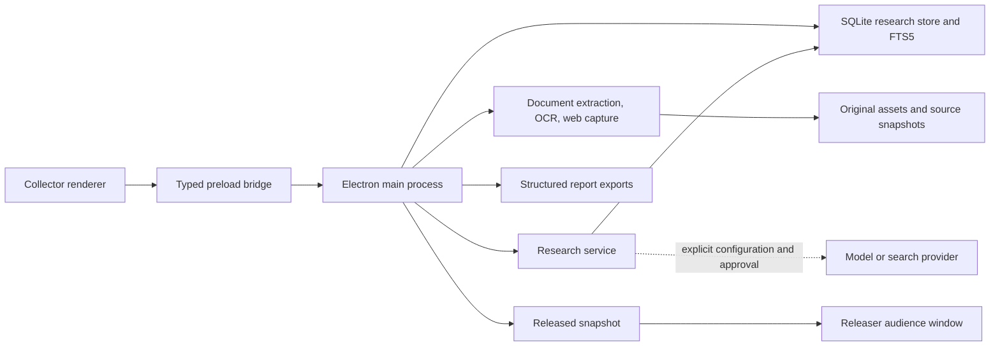

# Architecture

Acadia is a single-user Electron application. The Collector owns the editable investigation. The Releaser can run in the same window or as a separate audience window restricted to a selected released report. There is no hosted application server or required account. The current branch is the 1.0.0-rc.1 candidate; v0.5.0 remains the published release. Implementation in this document is separate from the qualification status in [v1 validation](VALIDATION-v1.0.md).

## Processes and boundaries

The renderers use React. React Flow supplies the board interaction model; Tiptap supplies structured report editing. Renderer code has no Node.js access. Credentials entered through the interface are submitted to the main process and excluded from returned settings. A context-isolated preload exposes the typed `AcadiaAPI`/`ResearchAPI` operations declared under `src/shared`.

The main process validates IPC senders and request data, owns persistence and network requests, and denies Collector-only operations to the audience window. Window updates for the audience contain the selected released revision rather than the draft output library. Cited historical passages can be read without granting mutation access.

## Storage model

Data lives in the `workspace` directory beneath Electron's user-data location. `ACADIA_USER_DATA` can select an absolute, isolated profile for development and tests.

`research.sqlite` uses SQLite WAL mode. Projects, sources, versions, passages, claims, tasks, jobs, analysis runs, discovery results, and approved plans have separate entity tables. Pedigree entities, revisions and snapshots retain briefs, appraisals, source origins, findings, assumptions, methods, review issues, gaps and decisions. Validated JSON carries each entity's payload; indexed columns establish lookup paths. `passage_fts` is the rebuildable FTS5 text index. The project record contains board layout and report/revision structures. Project-scoped private drafts have their own keys, kinds, target identifiers and optimistic revisions; they do not count as accepted research. Renderer draft envelopes retain the original record signature, and conflicting live changes require explicit review or discard. Pending writes are flushed before project changes, close and maintenance operations.

Original imported files are stored separately from the database and identified through an asset manifest. A board card can reference a source; the source library remains available independently of the card's visual placement or removal. Opening an original produces a viewing copy rather than modifying the stored evidence.

Typed board references connect cards to canonical sources/passages, briefs, claims, accepted reviews, assumptions, tasks, methods, gaps, decisions, reports and delivery plans. Placement is explicit and deduplicated; removing a linked card keeps the record. The renderer resolves current titles, previews and status without saving copied analytical text as a source. Passage cards retain exact source-version references; accepted reviews retain their original collected-item and citation provenance. Legacy method-card source copies remain readable for historical citations but are excluded from new retrieval and independent-source counts.

| Record                  | Purpose                                                                                                     |
| ----------------------- | ----------------------------------------------------------------------------------------------------------- |
| Source                  | Stable source identity, current version, metadata, board association, inclusion policy.                     |
| Source version          | Content hash, acquisition metadata, original/snapshot reference, extraction method and coverage.            |
| Passage                 | Exact text tied to one source version and a page/paragraph locator.                                         |
| Claim and evidence link | Researcher's assessment, alternatives, limitations, and support/contradiction/context passages.             |
| Research task           | Question or gap, status, completion criterion, optional due date, resulting sources.                        |
| Analysis run            | Question, directions, provider/model, selected evidence snapshot, exclusions, response, and outcome.        |
| Report revision         | Immutable structured document, rendered Markdown, citations, date, and revision note.                       |
| Accepted Reviewer Notes | Human-accepted item advice, original item association, exact citations and acceptance provenance.           |
| Research gap            | Revisioned missing information, importance, resolution criteria, findings, related tasks and manual status. |
| Decision                | Revisioned action, rationale, alternatives, findings, assumptions, deliverables and manual status.          |

Content-bearing source versions and passages preserve historical evidence. Extraction state records whether coverage is queued, processing, ready, partial, awaiting OCR, failed, or cancelled. A source update selects a new current version without rewriting citations in a previously saved report.

The v1 candidate writes portable `.acadia` format v5, containing project data, typed board references, originals, source history, evidence, tasks, reports, analysis provenance, pedigree records/revisions/snapshots, private drafts and delivery traceability. Formats v1–v4 remain importable; missing assessments stay unassessed. Credentials and rebuildable indexes are excluded. Import validates project ownership, relationships and archive contents before replacement. Existing investigations get recovery archives; SQLite schema upgrades use consistent backups and transactional migration. Missing linked records remain visibly unavailable placements. Format v5 requires Acadia v1 or its compatible release candidate; v0.5 cannot open it. Private drafts in archives remain drafts after import. Research-table materialization and serialization run in a worker under a consistent read transaction, followed by original-file reads and archive compression. The caller supplies the saved board/report revision. Export checks historical original hashes and the same size/count ceilings enforced on import, so an oversized investigation fails before writing an unusable archive. The captured board/report JSON is still prepared in the main process within its 50 MB ceiling. Whole-library backup remains available for investigations beyond portable limits.

Whole-library backups use a consistent SQLite snapshot and separately copied originals, checked through the attachment catalog and a SHA-256 manifest. Restoration validates the selected backup and its staged copy, preserves the current workspace, retains installation credentials locally, and restarts. A startup failure offers recovery instead of creating an empty replacement library. Diagnostics record operation/error codes without research content or private paths. The manual update check reads GitHub release metadata; it does not install updates. See [backup and recovery](RECOVERY.md) for the operational boundaries.

## Ingestion and background work

PDF extraction retains page locations; Word and readable web/text extraction retains paragraph locations. Scanned PDF pages are rendered before local Tesseract OCR. OCR workers, the recognition runtime, and English language data ship with the packaged app. Web capture fetches a selected public URL, applies Readability and sanitization, and does not execute page scripts or automatically load page resources.

Jobs persist their kind, status, progress, result, and failure information. Changes notify the renderer to refresh its research state. Cancellation and explicit retries are supported. Work interrupted by shutdown is marked failed with an explanation on next launch; network/model jobs do not silently resume.

Extraction indexes complete supported documents rather than a leading excerpt. Storage, parsing, network-response, and model-context limits still apply. Extraction failures and partial coverage are carried into the research workflow rather than reported as complete analysis.

## Retrieval and models

The research service resolves an explicit per-project analysis configuration. Local projects use the offline engine or a loopback model endpoint. Cloud projects require a configured provider, endpoint, and model. Credential reuse requires a matching provider and normalized endpoint.

Analysis searches included current-version passages across support, counterevidence, and gap-oriented queries. Separate candidate queries prevent pinned passages from displacing counterevidence before budget allocation. Four equally reserved pools cover pins, support, counterevidence and gaps; unused capacity is redistributed, with selection reasons and omissions retained. Query intent is not an evidential-support classification. Pin and exclusion policies, extraction coverage, and duplicate hashes affect selection. Query expansion can use the configured model; deterministic queries remain available when expansion fails. Each request has a provider-aware passage/context budget, and the run records what was included and excluded. The source library, search and reader use paged operations so later results remain reachable without transferring a full investigation into every view.

The model returns a structured Markdown response containing supplied numeric source references. Acadia resolves references against retrieved passages, creates the citation records, rejects unknown references, checks detected literal quotations, and records the run. Quotation detection and associated-reference checks reject unsupported detected quotations and surface ambiguity; they are not a general claim-truth test or exhaustive language verifier. Citation validation establishes source provenance, not the truth of a finding or the strength of its reasoning. An insufficient-evidence response is a valid research outcome.

Per-item summaries run only on request and use the selected item's canonical record or saved source version. A bounded passage sample exposes coverage limits and respects exclusions. Advice remains a proposal until the researcher edits and accepts it into Reviewer Notes; acceptance preserves provenance and creates provisional evidence rather than automatically declaring support. Changed linked records flag earlier advice for review. These analytical records never become additional original sources merely by being placed on the board.

Brave discovery has a separate approval path. A project-owned plan records visible queries and limits; approval consumes that plan. Results enter an inbox. Accepting a candidate starts capture, while adding a source to the board is a separate researcher action.

## Report lifecycle

The editor stores Tiptap JSON, including citation atoms keyed by citation identity. Markdown input is parsed as text with unsafe embedded content excluded. Shared serializers use the structured report for Markdown, DOCX, and print HTML/PDF exports. Manual citation insertion resolves an exact saved passage, including available author, date, publisher and DOI metadata; the bibliography retains this snapshot. Original PDF page comparison keeps the historical source-version context visible alongside extracted text.

An AI section revision is a proposal. The editor checks the report snapshot and selected text before replacement, preserves untouched content, and requires acceptance. Saving a revision clones document and citation state. Releasing selects one saved revision; continued draft edits do not alter the audience view. Failed generation leaves existing outputs intact and is labeled as a failure in the main interface.

## Research-to-delivery handoffs

Delivery plans and work packages can reference exact gap/finding revisions. Requirements, learning objectives, acceptance tests and verification evidence belong to the editable plan; verification links identify the passage, source and immutable version. Authoritative validation checks project ownership and historical revisions. Completing a work package never resolves a research gap automatically. An explicit researcher assessment controls that state.

The delivery editor persists a recoverable private draft before applying the plan to the current report. Application merges only the reviewed plan into the latest output, preserving unrelated writing. PMIS exports retain stable work-package identifiers, mapping previews and repeat-import warnings; they create local files, not remote synchronization or guaranteed upserts. Power BI tables expose gap, decision, accepted-review and delivery relationships. Derived analytical source copies remain identifiable for historical joins and are excluded from the original-evidence count. See [PMIS handoff](PMIS-HANDOFF.md) and [Power BI](POWER-BI.md); local export validation does not substitute for live destination acceptance.

## Code map and tests

| Area                                                 | Main entry points                                                                                   |
| ---------------------------------------------------- | --------------------------------------------------------------------------------------------------- |
| Application lifecycle, IPC, recovery, display policy | `src/main/index.ts`, `src/preload/index.ts`                                                         |
| Store, portable validation, extraction               | `src/main/research-store.ts`, `src/main/ingestion.ts`                                               |
| Retrieval, privacy, discovery, provider requests     | `src/main/research-service.ts`, `src/main/analysis.ts`                                              |
| Schemas, project validation, report snapshots        | `src/shared/research.ts`, `src/shared/project.ts`, `src/shared/report.ts`                           |
| Linked board records, pedigree and item reviews      | `src/shared/board.ts`, `src/shared/pedigree.ts`, `src/shared/item-insight.ts`                       |
| Collector and source/evidence/task interfaces        | `src/renderer/App.tsx`, `src/renderer/components/ResearchWorkspace.tsx`                             |
| Item placement and gaps/decisions                    | `src/renderer/components/BoardItemPicker.tsx`, `src/renderer/components/ResearchFlowWorkspace.tsx`  |
| Recoverable private drafts                           | `src/renderer/components/durableDrafts.ts`, `src/renderer/components/DraftStatus.tsx`               |
| Library maintenance and archive compression          | `src/main/maintenance.ts`, `src/main/archive-worker.ts`                                             |
| Delivery and external data handoffs                  | `src/shared/pmis.ts`, `src/main/powerbi-export.ts`, `src/renderer/components/DeliveryPlanPanel.tsx` |
| Report editor and export                             | `src/renderer/components/ReportEditor.tsx`, `src/main/report-export.ts`                             |

Vitest exercises validation, storage, extraction, retrieval, privacy, grounding, revision behavior, and export structure. Playwright launches real Electron processes with disposable profiles for UI, persistence, migration, native document exports, OCR, and released-window restrictions. Known research fixtures include late-document counterevidence, duplicates, and unresolved gaps. Package and physical-hardware checks are separate from unit-test success. Long-report fixtures exercise tables and bibliographic metadata across DOCX, Markdown and native PDF. Optional scale fixtures measure a declared 1,000-source/100,000-passage/500-card investigation; actual machine results and the reference-machine acceptance are separate. Model-quality evaluations separately report retrieval, support review, contradiction handling and abstention; one valid response is not a model compatibility certification.

The release pipeline requires native package tests, checksums and recorded assurance. Production v1+ additionally requires Developer ID signing/notarization, Windows distribution signing and reviewed external acceptance tied to the exact source commit. Release candidates are explicitly prereleases. No current signing, installation, external-tenant or physical-hardware success should be inferred from the pipeline configuration.
