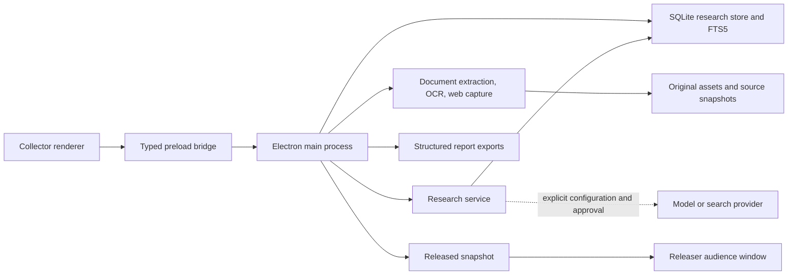

# Architecture

Acadia is a single-user Electron application. The Collector owns the editable investigation. The Releaser can run in the same window or as a separate audience window restricted to a selected released report. There is no hosted application server or required account.

## Processes and boundaries

The renderers use React. React Flow supplies the board interaction model; Tiptap supplies structured report editing. Renderer code has no Node.js access. Credentials entered through the interface are submitted to the main process and excluded from returned settings. A context-isolated preload exposes the typed `AcadiaAPI`/`ResearchAPI` operations declared under `src/shared`.

The main process validates IPC senders and request data, owns persistence and network requests, and denies Collector-only operations to the audience window. Window updates for the audience contain the selected released revision rather than the draft output library. Cited historical passages can be read without granting mutation access.

## Storage model

Data lives in the `workspace` directory beneath Electron's user-data location. `ACADIA_USER_DATA` can select an absolute, isolated profile for development and tests.

`research.sqlite` uses SQLite WAL mode. Projects, sources, versions, passages, claims, tasks, jobs, analysis runs, discovery results, and approved plans have separate entity tables. Pedigree entities, revisions and snapshots retain briefs, appraisals, source origins, findings, assumptions, methods, review issues, gaps and decisions. Validated JSON carries each entity's payload; indexed columns establish lookup paths. `passage_fts` is the rebuildable FTS5 text index. The project record contains board layout and report/revision structures.

Original imported files are stored separately from the database and identified through an asset manifest. A board card can reference a source; the source library remains available independently of the card's visual placement or removal. Opening an original produces a viewing copy rather than modifying the stored evidence.

Typed board references connect cards to canonical sources/passages, briefs, claims, accepted reviews, assumptions, tasks, methods, gaps, decisions, reports and delivery plans. Placement is explicit and deduplicated; removing a linked card keeps the record. The renderer resolves current titles, previews and status without saving copied analytical text as a source. Passage cards retain exact source-version references; accepted reviews retain their original collected-item and citation provenance. Legacy method-card source copies remain readable for historical citations but are excluded from new retrieval and independent-source counts.

| Record                  | Purpose                                                                                                     |
| ----------------------- | ----------------------------------------------------------------------------------------------------------- |
| Source                  | Stable source identity, current version, metadata, board association, inclusion policy.                     |
| Source version          | Content hash, acquisition metadata, original/snapshot reference, extraction method and coverage.            |
| Passage                 | Exact text tied to one source version and a page/paragraph locator.                                         |
| Claim and evidence link | Researcher's assessment, alternatives, limitations, and support/contradiction/context passages.             |
| Research task           | Question or gap, status, completion criterion, optional due date, resulting sources.                        |
| Analysis run            | Question, directions, provider/model, selected evidence snapshot, exclusions, response, and outcome.        |
| Report revision         | Immutable structured document, rendered Markdown, citations, date, and revision note.                       |
| Accepted Reviewer Notes | Human-accepted item advice, original item association, exact citations and acceptance provenance.           |
| Research gap            | Revisioned missing information, importance, resolution criteria, findings, related tasks and manual status. |
| Decision                | Revisioned action, rationale, alternatives, findings, assumptions, deliverables and manual status.          |

Content-bearing source versions and passages preserve historical evidence. Extraction state records whether coverage is queued, processing, ready, partial, awaiting OCR, failed, or cancelled. A source update selects a new current version without rewriting citations in a previously saved report.

Acadia v0.5.0 writes portable `.acadia` format v4, containing project data, typed board references, originals, source history, evidence, tasks, reports, analysis provenance and pedigree records/revisions/snapshots. Formats v1–v3 remain importable; missing assessments stay unassessed. Credentials and rebuildable indexes are excluded. Import validates project ownership, relationships and archive contents before replacement. Existing investigations get recovery archives; SQLite schema upgrades use consistent backups and transactional migration. Missing linked records remain visibly unavailable placements. Earlier Acadia builds cannot open v4.

## Ingestion and background work

PDF extraction retains page locations; Word and readable web/text extraction retains paragraph locations. Scanned PDF pages are rendered before local Tesseract OCR. OCR workers, the recognition runtime, and English language data ship with the packaged app. Web capture fetches a selected public URL, applies Readability and sanitization, and does not execute page scripts or automatically load page resources.

Jobs persist their kind, status, progress, result, and failure information. Changes notify the renderer to refresh its research state. Cancellation and explicit retries are supported. Work interrupted by shutdown is marked failed with an explanation on next launch; network/model jobs do not silently resume.

Extraction indexes complete supported documents rather than a leading excerpt. Storage, parsing, network-response, and model-context limits still apply. Extraction failures and partial coverage are carried into the research workflow rather than reported as complete analysis.

## Retrieval and models

The research service resolves an explicit per-project analysis configuration. Local projects use the offline engine or a loopback model endpoint. Cloud projects require a configured provider, endpoint, and model. Credential reuse requires a matching provider and normalized endpoint.

Analysis searches included current-version passages across support, counterevidence, and gap-oriented queries. Pin and exclusion policies, extraction coverage, and duplicate hashes affect selection. Query expansion can use the configured model; deterministic queries remain available when expansion fails. Each request has a provider-aware passage/context budget, and the run records what was included and excluded.

The model returns a structured Markdown response containing supplied numeric source references. Acadia resolves references against retrieved passages, creates the citation records, rejects unknown references, checks detected literal quotations, and records the run. Automatic quotation detection covers single-line text of at least 20 characters inside straight or curly double quotes; it is not exhaustive. Citation validation establishes source provenance, not the truth of a finding or the strength of its reasoning. An insufficient-evidence response is a valid research outcome.

Per-item summaries run only on request and use the selected item's canonical record or saved source version. A bounded passage sample exposes coverage limits and respects exclusions. Advice remains a proposal until the researcher edits and accepts it into Reviewer Notes; acceptance preserves provenance and creates provisional evidence rather than automatically declaring support. Changed linked records flag earlier advice for review. These analytical records never become additional original sources merely by being placed on the board.

Brave discovery has a separate approval path. A project-owned plan records visible queries and limits; approval consumes that plan. Results enter an inbox. Accepting a candidate starts capture, while adding a source to the board is a separate researcher action.

## Report lifecycle

The editor stores Tiptap JSON, including citation atoms keyed by citation identity. Markdown input is parsed as text with unsafe embedded content excluded. Shared serializers use the structured report for Markdown, DOCX, and print HTML/PDF exports.

An AI section revision is a proposal. The editor checks the report snapshot and selected text before replacement, preserves untouched content, and requires acceptance. Saving a revision clones document and citation state. Releasing selects one saved revision; continued draft edits do not alter the audience view. Failed generation leaves existing outputs intact and is labeled as a failure in the main interface.

## Code map and tests

| Area                                                 | Main entry points                                                                                  |
| ---------------------------------------------------- | -------------------------------------------------------------------------------------------------- |
| Application lifecycle, IPC, recovery, display policy | `src/main/index.ts`, `src/preload/index.ts`                                                        |
| Store, portable validation, extraction               | `src/main/research-store.ts`, `src/main/ingestion.ts`                                              |
| Retrieval, privacy, discovery, provider requests     | `src/main/research-service.ts`, `src/main/analysis.ts`                                             |
| Schemas, project validation, report snapshots        | `src/shared/research.ts`, `src/shared/project.ts`, `src/shared/report.ts`                          |
| Linked board records, pedigree and item reviews      | `src/shared/board.ts`, `src/shared/pedigree.ts`, `src/shared/item-insight.ts`                      |
| Collector and source/evidence/task interfaces        | `src/renderer/App.tsx`, `src/renderer/components/ResearchWorkspace.tsx`                            |
| Item placement and gaps/decisions                    | `src/renderer/components/BoardItemPicker.tsx`, `src/renderer/components/ResearchFlowWorkspace.tsx` |
| Report editor and export                             | `src/renderer/components/ReportEditor.tsx`, `src/main/report-export.ts`                            |

Vitest exercises validation, storage, extraction, retrieval, privacy, grounding, revision behavior, and export structure. Playwright launches real Electron processes with disposable profiles for UI, persistence, migration, native document exports, OCR, and released-window restrictions. Known research fixtures include late-document counterevidence, duplicates, and unresolved gaps. Package and physical-hardware checks are separate from unit-test success.
