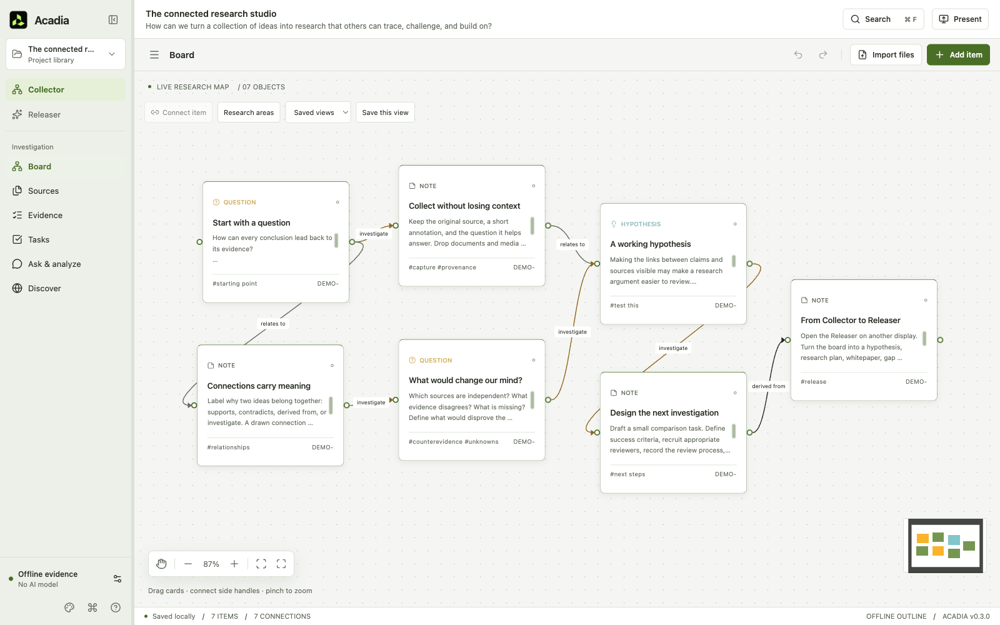
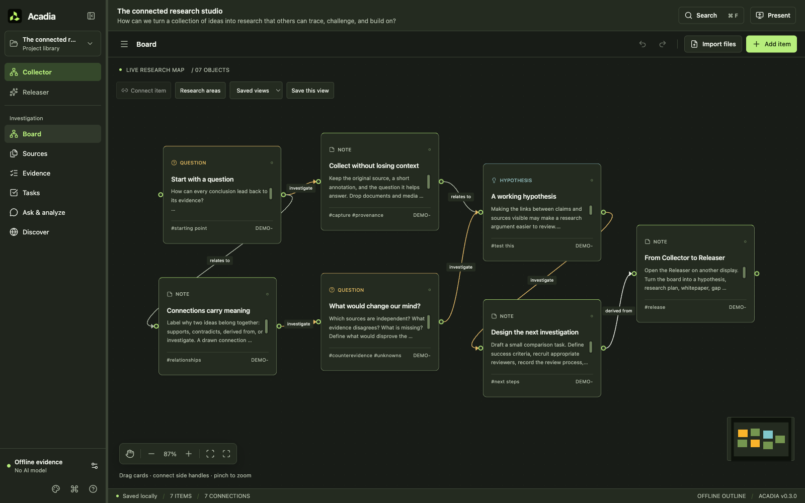
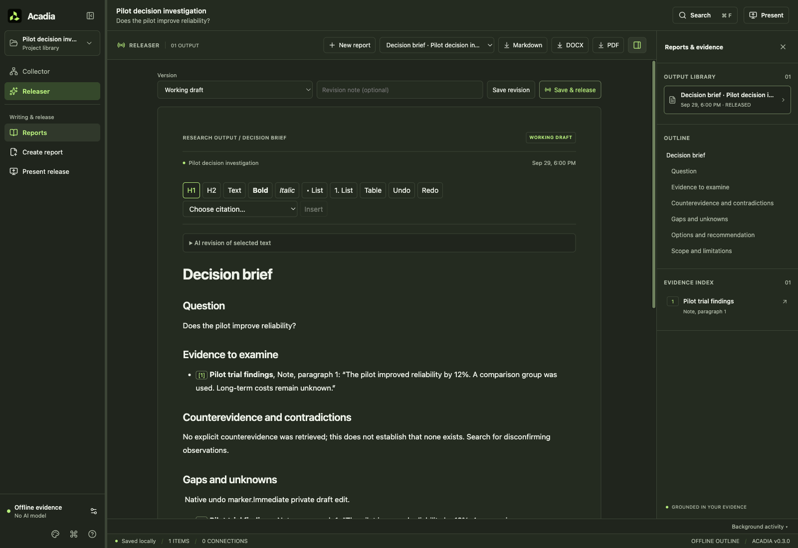

# Desktop workspace refresh

This interface is included in Acadia v0.4.0. Existing v0.3.0 installers do not include it. Restart the **Acadia** run configuration in WebStorm after updating the source so the Electron main process and preload load alongside the new interface. The interface continues in v0.5.0; see the [v0.5 validation record](VALIDATION-v0.5.md) for current checks and platform limits.

## Workspace

Acadia retains its approved branding and Collector/Releaser workflow. A compact navigation sidebar replaces the dense dashboard header. The project menu, investigation search, presentation controls, appearance, and research engine settings have consistent locations. Board items and report/evidence inspectors are available when needed.

The Collector provides Research brief, Board, Sources, Evidence, Methods, Tasks, Ask & analyze, and Discover views. **Add item** includes five research methods that create linked worksheet cards. Source passages open beside the current work. On smaller windows, the reader becomes an overlay with an explicit close control. A reader page contains at most 40 passages; exact citations jump to the relevant page automatically. Source metadata, extraction coverage, OCR labels, contradictions, and original version references remain visible.

The Releaser opens reports as documents. **New report** opens the composer; **Reports and evidence** reveals the library, document outline, and citation sources. Draft edits remain separate from saved revisions and the explicitly released audience version. Revoking or replacing a release also clears any citation reader left open on the audience display.

Screenshots below use disposable sample investigations. The Releaser screenshot includes test text used to verify editing; it is not a research finding.

## Desktop behavior

- Native window frames, platform application menus, and platform keyboard shortcuts.
- System, Light, and Dark appearance; comfortable, compact, and touch control sizes.
- System reduced-motion and contrast preferences, visible keyboard focus, labeled controls, and keyboard-operable pane dividers.
- Window position, size, and maximized state restored with recovery when a display is disconnected.
- Per-project navigation, board viewport, report selection, revision, and scroll position restored locally. Evidence-entry drafts survive reader view changes within the running session; save them before quitting.
- **Cmd/Ctrl+K** opens commands; **Cmd/Ctrl+F** searches board cards, indexed source passages, evidence, and reports. Undo/redo follows the focused text editor or board.

UI preferences stay on the computer and are excluded from portable investigation archives. The interface uses a shared Electron renderer with native desktop integration; it does not replace the research engine with separate platform applications.

Unsent question, source-search, URL-capture, and discovery-query text survives navigation during the session. Discovery approvals are never restored from these drafts. You can continue using other views while a report generates; wait for completion or cancel the activity before switching investigations.

## Connections

Named connection presets store the provider, endpoint, model, and project privacy choice without API keys. Keys continue to use the existing secure-storage policy. Local model discovery and connection checks run only when requested. Connection tests inspect model availability without sending research or generating text; generation permissions and billing can still fail separately.

Each investigation retains its explicit Local or Server/cloud setting. An SSH tunnel to another computer still requires the server/cloud choice. No model service is installed or changed by this interface update.

## Responsiveness and data preservation

The source reader bounds mounted passages, research refreshes are coalesced, and derived report Markdown is batched outside the immediate typing update. Structured report content and citation objects update synchronously, with pending Markdown flushed for transitions, exports, revisions, and close. Board undo preserves current reports, release selection, and project privacy.

These are targeted responsiveness improvements, not a measured performance guarantee for arbitrary investigation sizes.

## Validation

Automated checks use disposable research profiles and local model stubs; they do not use the researcher's saved projects or real model credentials. Coverage includes source and historical citation navigation, project switching, report edits and exports, release isolation, keyboard behavior, appearance persistence, model inventory checks, and restored workspace context.

The initial GUI checkpoint was validated on macOS arm64 on September 29, 2026. These counts describe that earlier checkpoint, not the complete v0.4 suite:

- TypeScript and production Electron build passed.
- 206 unit tests passed across 12 files.
- All 23 native Electron scenarios passed against the final build. The integrated run passed 22; the remaining scenario had an obsolete source-reader label assertion. It passed on rerun after checking the saved version and passage identifiers directly.
- Light/dark Collector and document/inspector layouts were visually reviewed.
- `git diff --check` passed.

Use `npm test`, `npm run build`, and `npm run test:e2e` to repeat the automated checks. Native tests include simulated touch, explicit cloud opt-in and discovery approval, failed extraction/migration recovery, historical citations across archive round trips, editor focus, and the audience privacy boundary. No live provider generation or billing test was repeated for this GUI update.

Native Windows and Ubuntu runtime acceptance, screen-reader evaluation, physical touchscreen operation, physical dual-display use, and mixed-DPI behavior require separate validation. Automated macOS tests or simulated touch events do not establish those results. Publication and platform results are recorded separately in [GitHub Releases](https://github.com/byrneDev/Acadia/releases) and the [v0.5 validation record](VALIDATION-v0.5.md).

See [Quick start](QUICK-START.md) for the user workflow and [release preparation](RELEASING.md) before packaging or publishing.
